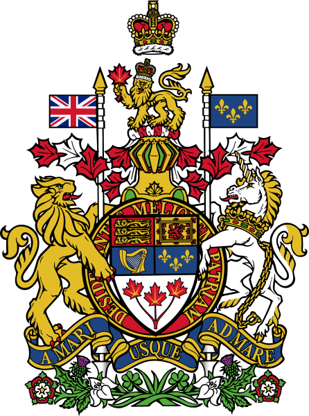
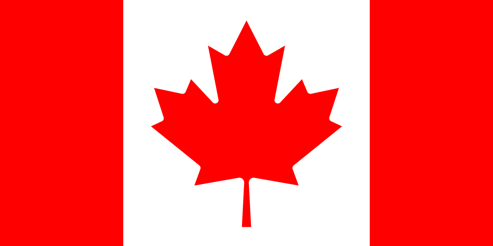

---
aliases:
  - Canada
  - Canadá
  - كندا
  - 加拿大
  - Канада
  - el Canadá
  - Canadá (el)
  - ReadMe
title: Canada
location:
  - 50.4137
  - -87.1444
type: Country
SpocWebEntityId: 26860
isDeleted: false
confidential: public
tags:
  - geo/Country
license: CC BY-SA 4.0
isReadOnly: false
source: https://datahub.io/core/country-codes
cssclasses:
  - Country
publish: true
linkTitle: ""
keywords: ""
layout: ""
draft: false
publishDate: ""
expiryDate: ""
Languages:
  - en-CA
  - fr-CA
  - iu
icon: flag-ca
dv_has_:
  name_:
  url_for_:
    code_repository: https://github.com/SpocWiki/America-Canada
  image_for_:
    coat_of_arms: "![[./Coat_of_arms_of_Canada.svg|250]]"
    flag: "![[./Flag_of_Canada.svg|200]] "
  sound_of_:
    anthem: "![[Anthem-Canada.mp3]]"
  telephone_:
    Prefix_:
      International: 11
      country: 1
dv_has_name_en: Canada
dv_has_name_de: Kanada
dv_ISO2: CA
dv_ISO3: CAN
dv_ISO4217-currency_alphabetic: CAD
dv_ISO4217-currency_name: Canadian Dollar
dv_ISO4217-currency_numeric: 124
dv_ISO4217-currency_minor_unit: 2
dv_ISO4217-currency_country_name: CANADA
dv_Global: true
dv_Global_Name: World
dv_has_name_: Canada
dv_has_name_es: Canadá
dv_has_name_fr: Canada
dv_has_name_cn: 加拿大
dv_has_name_ar: كندا
dv_has_name_ru: Канада
dv_CLDR_display_name: Canada
dv_UNTERM_English: Canada
dv_UNTERM_English_Formal: Canada
dv_UNTERM_Spanish_Formal: el Canadá
dv_UNTERM_Spanish: Canadá (el)
dv_UNTERM_French: Canada (le)
dv_UNTERM_Arabic: كندا
dv_UNTERM_Arabic_Formal: كندا
dv_UNTERM_Chinese: 加拿大
dv_UNTERM_Chinese_Formal: 加拿大
dv_UNTERM_French_Formal: le Canada
dv_UNTERM_Russian: Канада
dv_UNTERM_Russian_Formal: Канада
dv_Region_Name: "[[Americas]]"
dv_Intermediate_Region_Name: "[[ReadMe]]"
dv_Sub-region_Name: "[[Northern America]]"
dv_Region: 19
dv_Sub-region: 21
dv_Geoname-ID: 6251999
dv_FIPS: CA
dv_FIFA: CAN
dv_IOC: CAN
dv_MARC: xxc
dv_GAUL: 46
dv_WMO: CN
dv_ITU: CAN
dv_DS: CDN
dv_TLD: .ca
dv_M49: 124
dv_is_independent: Yes
dv_Developed_:
  Developing_Countries: Developed
dv_ISO3166-1-numeric: 124
dv_Area-Total: 9958319
dv_Area-Land: 9220970
dv_has_place_continent: "[[North-America]]"
dv_VehicleCode: CDN
dv_Capital: "[[Canada/State/State~Ontario/City/Ottawa]]"
dv_Alcohol-l: 9.8
dv_Language-Id: 499
dv_has_place_longitude: -87.1444
dv_has_place_latitude: 50.4137
dv_has_url_for_code_repository: https://github.com/SpocWiki/America-Canada
dv_has_image_for_coat_of_arms: "![[./Coat_of_arms_of_Canada.svg|250]]"
dv_has_sound_of_anthem: "![[Anthem-Canada.mp3]]"
dv_has_image_for_flag: "![[./Flag_of_Canada.svg|200]] "
dv_has_telephone_prefix_international: 11
dv_has_telephone_prefix_country: 1
dv_developed_developing_countries: Developed
---

# Canada 

has_url_for_code_repository = `=this.dv_has_url_for_code_repository`

[has_name_en::Canada] 
has_name_de = `=this.dv_has_name_de` 

ISO2 = `=this.dv_ISO2` 
ISO3 = `=this.dv_ISO3` 

This Repository/Folder/Wiki/Vault contains freely usable Text and Data 
covering the Country of [Canada](https://en.wikipedia.org/wiki/Canada).   

This Repository is intended to be shared as a common basis, 
by including it as a Sub-Repository in local File-Systems, 
specifically as part of the [\_Standards](https://github.com/SpocWiki/_Standards) Repository. 

Check out this Repository into this Subfolder: 
\_Standards/geo/Continent/America~North/Canada


## #has_/text_of_/abstract  

> **Canada** is a country in North America. Its ten provinces and three territories extend from the Atlantic Ocean to the Pacific Ocean and northward into the Arctic Ocean, making it the world's second-largest country by total area, with the world's longest coastline. Its border with the United States is the world's longest international land border. The country is characterized by a wide range of both meteorologic and geological regions. It is a sparsely inhabited country of 40 million people, the vast majority residing south of the 55th parallel in urban areas. Canada's capital is Ottawa and its three largest metropolitan areas are Toronto, Montreal, and Vancouver.
>
> Indigenous peoples have continuously inhabited what is now Canada for thousands of years. Beginning in the 16th century, British and French expeditions explored and later settled along the Atlantic coast. As a consequence of various armed conflicts, France ceded nearly all of its colonies in North America in 1763. In 1867, with the union of three British North American colonies through Confederation, Canada was formed as a federal dominion of four provinces. This began an accretion of provinces and territories and a process of increasing autonomy from the United Kingdom, highlighted by the Statute of Westminster, 1931, and culminating in the Canada Act 1982, which severed the vestiges of legal dependence on the Parliament of the United Kingdom.
>
> Canada is a parliamentary democracy and a constitutional monarchy in the Westminster tradition. The country's head of government is the prime minister, who holds office by virtue of their ability to command the confidence of the elected House of Commons and is "called upon" by the governor general, representing the monarch of Canada, the head of state. The country is a Commonwealth realm and is officially bilingual (English and French) in the federal jurisdiction. It is very highly ranked in international measurements of government transparency, quality of life, economic competitiveness, innovation, education and gender equality. It is one of the world's most ethnically diverse and multicultural nations, the product of large-scale immigration. Canada's long and complex relationship with the United States has had a significant impact on its history, economy, and culture.
>
> A developed country, Canada has a high nominal per capita income globally and its advanced economy ranks among the largest in the world, relying chiefly upon its abundant natural resources and well-developed international trade networks. Canada is recognized as a middle power for its role in international affairs, with a tendency to pursue multilateral and international solutions. Canada's peacekeeping role during the 20th century has had a significant influence on its global image. Canada is part of multiple international organizations and forums.
>
> [Wikipedia](https://en.wikipedia.org/wiki/Canada)


## Maps and Flags 

### #has_/image_for_/coat_of_arms 

has_image_for_coat_of_arms = `=this.dv_has_image_for_coat_of_arms`

has_sound_of_anthem = `=this.dv_has_sound_of_anthem`

### #has_/image_for_/flag

has_image_for_flag = `=this.dv_has_image_for_flag`

### #has_/map

```leaflet
id: Canada
zoomFeatures: true 
minZoom: 4 
maxZoom: 18
geojsonFolder: provinces~Canada/
markerFolder: provinces~Canada/
```

has_telephone_prefix_international = `=this.dv_has_telephone_prefix_international`
has_telephone_prefix_country = `=this.dv_has_telephone_prefix_country`

ISO4217-currency_alphabetic = `=this.dv_ISO4217-currency_alphabetic` 
ISO4217-currency_name = `=this.dv_ISO4217-currency_name` 
ISO4217-currency_numeric = `=this.dv_ISO4217-currency_numeric` 
ISO4217-currency_minor_unit = `=this.dv_ISO4217-currency_minor_unit` 
ISO4217-currency_country_name = `=this.dv_ISO4217-currency_country_name` 

Global = `=this.dv_Global` 
Global_Name = `=this.dv_Global_Name` 

name = `=this.dv_name` 
[	has_name_en	 :: Canada ] 
has_name_es = `=this.dv_has_name_es` 
has_name_fr = `=this.dv_has_name_fr` 
has_name_cn = `=this.dv_has_name_cn` 
has_name_ar = `=this.dv_has_name_ar` 
has_name_ru = `=this.dv_has_name_ru` 

CLDR_display_name = `=this.dv_CLDR_display_name` 

UNTERM_English = `=this.dv_UNTERM_English` 
UNTERM_English_Formal = `=this.dv_UNTERM_English_Formal` 
UNTERM_Spanish_Formal = `=this.dv_UNTERM_Spanish_Formal` 
UNTERM_Spanish = `=this.dv_UNTERM_Spanish` 
UNTERM_French = `=this.dv_UNTERM_French` 
UNTERM_Arabic = `=this.dv_UNTERM_Arabic` 
UNTERM_Arabic_Formal = `=this.dv_UNTERM_Arabic_Formal` 
UNTERM_Chinese = `=this.dv_UNTERM_Chinese` 
UNTERM_Chinese_Formal = `=this.dv_UNTERM_Chinese_Formal` 
UNTERM_French_Formal = `=this.dv_UNTERM_French_Formal` 
UNTERM_Russian = `=this.dv_UNTERM_Russian` 
UNTERM_Russian_Formal = `=this.dv_UNTERM_Russian_Formal` 

Region_Name = `=this.dv_Region_Name`
Intermediate_Region_Name = `=this.dv_Intermediate_Region_Name`
Sub-region_Name = `=this.dv_Sub-region_Name`

Region = `=this.dv_Region` 
[	Intermediate_Region = `=this.dv_Region`
Sub-region = `=this.dv_Sub-region` 

Geoname-ID = `=this.dv_Geoname-ID` 
FIPS = `=this.dv_FIPS` 
FIFA = `=this.dv_FIFA` 
IOC = `=this.dv_IOC` 
MARC = `=this.dv_MARC` 
GAUL = `=this.dv_GAUL` 
WMO = `=this.dv_WMO` 
ITU = `=this.dv_ITU` 
DS = `=this.dv_DS` 
TLD = `=this.dv_TLD` 
[	EDGAR	 ::  ] 
M49 = `=this.dv_M49` 

is_independent = `=this.dv_is_independent` 
developed_developing_countries = `=this.dv_developed_developing_countries` 
[	Land_Locked_Developing_Countries	 ::  ] 
[	Least_Developed_Countries	 ::  ] 
[	Small_Island_Developing_States	 ::  ] 

ISO3166-1-numeric = `=this.dv_ISO3166-1-numeric` 


Area-Total = `=this.dv_Area-Total` 
Area-Land = `=this.dv_Area-Land` 
has_place_continent = `=this.dv_has_place_continent`
VehicleCode = `=this.dv_VehicleCode` 
Capital = `=this.dv_Capital`
Alcohol-l = `=this.dv_Alcohol-l` 
Language-Id = `=this.dv_Language-Id` 
has_place_longitude = `=this.dv_has_place_longitude`
has_place_latitude = `=this.dv_has_place_latitude`


## Confidential Links & Embeds: 

### #is_/same_as :: [[/_Standards/Earth/Continent/America~North/Canada/ReadMe|ReadMe]] 

### #is_/same_as :: [[/_public/Earth/Continent/America~North/Canada/ReadMe.public|ReadMe.public]] 

### #is_/same_as :: [[/_internal/Earth/Continent/America~North/Canada/ReadMe.internal|ReadMe.internal]] 

### #is_/same_as :: [[/_protect/Earth/Continent/America~North/Canada/ReadMe.protect|ReadMe.protect]] 

### #is_/same_as :: [[/_private/Earth/Continent/America~North/Canada/ReadMe.private|ReadMe.private]] 

### #is_/same_as :: [[/_personal/Earth/Continent/America~North/Canada/ReadMe.personal|ReadMe.personal]] 

### #is_/same_as :: [[/_secret/Earth/Continent/America~North/Canada/ReadMe.secret|ReadMe.secret]] 

